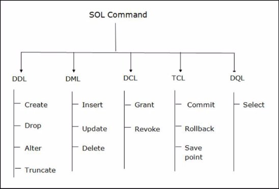
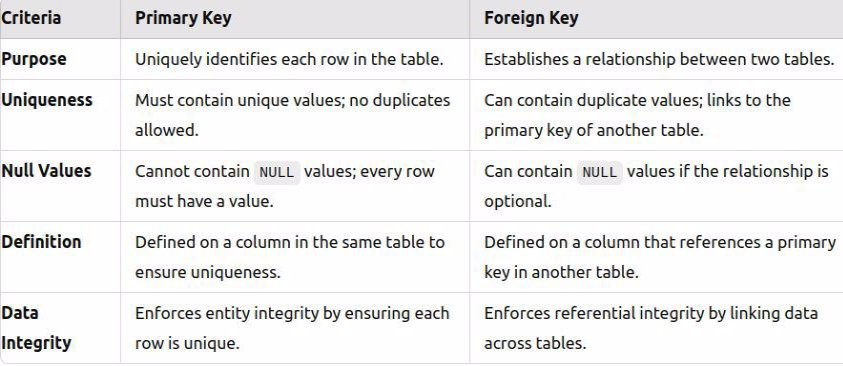
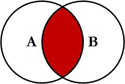
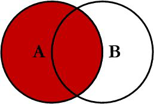
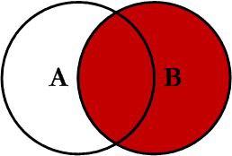
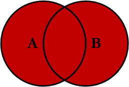
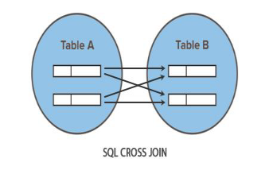

# Database Testing

**Instructor:** Salman Rahman  
**Sr. Software Engineer**  
Cefalo Bangladesh Ltd.

---

## What is Database Testing?

- Database Testing is a type of software testing that checks the schema, tables, triggers, etc. of the database under test. It also ensures data integrity and consistency. It may involve creating complex queries to load/stress test the database and check its responsiveness.

---

## What is SQL?

SQL (Structured Query Language) is a standardized programming language used for managing and manipulating relational databases. It provides a set of commands and syntax for performing various operations on databases, such as storing, retrieving, updating, and deleting data.

---

## Why is Database Testing Important?

- **Data Integrity and Accuracy:** Ensures that data stored within the database remains accurate, consistent, and error-free throughout various operations like insertion, retrieval, update, and deletion.
- **Performance Optimization:** Optimizes database queries and operations, leading to better application performance, reduced response times, and improved scalability under increased data loads.
- **Security and Compliance:** Identifies vulnerabilities, ensures robust security measures, and helps in compliance with industry standards and regulations.
- **Reliability and Scalability:** Validates the reliability of the database system to handle increased data volumes and user loads without compromising its performance.
- **Cost Efficiency and Risk Mitigation:** Early detection and resolution of database issues reduce the risk of failures, minimizing potential downtimes and the overall cost of fixing errors.

---

## Types of Databases

- **Relational Database:** Organizes data into tables related to each other through common fields. Examples: MySQL, PostgreSQL, Oracle, SQL Server.
- **NoSQL Database:** Designed to handle unstructured, semi-structured, or structured data. Examples: MongoDB, Firebase, DynamoDB.
- **NewSQL Database:** Combines the benefits of traditional SQL databases with the scalability of NoSQL databases. Examples: CockroachDB, NuoDB.

---

## Categories of SQL Commands:



## Key SQL Concepts

### Types of Keys:

- **Primary Key:** Uniquely identifies each row in a table.
- **Foreign Key:** Establishes a link between two tables by referencing the primary key in another table.
- **Unique Key:** Ensures that each value in a column is unique.
- **Composite Key:** Consists of multiple columns used together to uniquely identify each row.
- **Alternate Key:** A candidate key that was not selected as the primary key.
- **Super Key:** A set of columns that uniquely identifies each row in a table.
- **Surrogate Key:** A system-generated key, often an auto-incremented number.
- **Candidate Key:** Columns that can be defined as a primary key.

---

## Difference between primary and foreign key



## SQL Commands

### DML Queries

- **Insert:**

  ```sql
  INSERT INTO studentPersonal (firstname, lastname, fathername, mothername, city, area, fulladdress, bloodgroup, religion)
  VALUES ('Michael', 'Clark', 'John Clark', 'Lucy Clark', 'New York', 'Brooklyn', '456 Bedford Ave, Brooklyn, NY', 'O+', 'Christian');
  ```

- **Update:**

  ```sql
  UPDATE studentPersonal
  SET city = 'Los Angeles'
  WHERE studentId = 1;
  ```

- **Delete:**
  ```sql
  DELETE FROM studentPersonal
  WHERE studentId = 5;
  ```

---

### DQL Queries

- **SELECT:** Retrieve data.
- **WHERE:** Filter data.
- **ORDER BY:** Sort data.
- **GROUP BY:** Group data.
- **HAVING:** Filter groups.
- **DISTINCT:** Remove duplicates.
- **LIMIT:** Limit the number of results.
- **IN, BETWEEN, LIKE:** Filter based on multiple values, ranges, or patterns.

---

### Aggregate Functions

- **COUNT():** Counts the number of rows.
- **SUM():** Calculates the sum of a column.
- **AVG():** Calculates the average value.
- **MIN():** Finds the minimum value.
- **MAX():** Finds the maximum value.

#### Examples:

- **Count:**
  ```sql
  SELECT COUNT(*) AS count FROM payment WHERE amount > 500;
  ```
- **Sum:**
  ```sql
  SELECT SUM(amount) AS total_fees_paid FROM payment;
  ```
- **Average:**
  ```sql
  SELECT AVG(totalSemesterFees) AS avg_semester_fees FROM studentAcademic;
  ```
- **Minimum:**
  ```sql
  SELECT MIN(totalSemesterFees) AS min_mechanical_fees FROM studentAcademic WHERE departmentCode = 'ME103';
  ```
- **Maximum:**
  ```sql
  SELECT MAX(salary) AS max_cs_teacher_salary FROM teacherAcademic WHERE departmentCode = 'CS101';
  ```

---

### GROUP BY and HAVING

- **GROUP BY:**

  ```sql
  SELECT city, COUNT(*) FROM studentPersonal GROUP BY city;
  ```

- **HAVING:**
  ```sql
  SELECT city, COUNT(*)
  FROM studentPersonal
  GROUP BY city
  HAVING COUNT(*) > 1;
  ```

---

### Subqueries

1. **Find students who have not made a payment:**

   ```sql
   SELECT firstname, lastname
   FROM studentPersonal
   WHERE studentId NOT IN (SELECT studentId FROM payment);
   ```

2. **Find the departments with no students enrolled:**
   ```sql
   SELECT departmentName
   FROM departments
   WHERE departmentCode NOT IN (SELECT departmentCode FROM studentAcademic);
   ```

---

### CASE Statement

- Example:
  ```sql
  SELECT studentId, totalSemesterFees,
  CASE
      WHEN totalSemesterFees < 1500 THEN 'Low'
      WHEN totalSemesterFees BETWEEN 1500 AND 1800 THEN 'Medium'
      ELSE 'High'
  END AS fee_category
  FROM studentAcademic;
  ```

---

### Types of JOINs

1. **INNER JOIN:** Returns only the rows where there is a match in both tables.

   ```sql
   SELECT sp.firstname, sp.lastname, sa.departmentCode, sa.semester
   FROM studentPersonal sp
   INNER JOIN studentAcademic sa ON sp.studentId = sa.studentId;
   ```

   

2. **LEFT JOIN:** Returns all rows from the left table, and the matched rows from the right table.

   ```sql
   SELECT sp.firstname, sp.lastname, sa.departmentCode, sa.semester
   FROM studentPersonal sp
   LEFT JOIN studentAcademic sa ON sp.studentId = sa.studentId;
   ```

   

3. **RIGHT JOIN:** Returns all rows from the right table, and the matched rows from the left table.

   ```sql
   SELECT sp.firstname, sp.lastname, sa.departmentCode, sa.semester
   FROM studentPersonal sp
   RIGHT JOIN studentAcademic sa ON sp.studentId = sa.studentId;
   ```

   

4. **FULL OUTER JOIN:** Returns all rows when there is a match in either table.

   ```sql
   SELECT sp.firstname, sp.lastname, sa.departmentCode, sa.semester
   FROM studentPersonal sp
   LEFT JOIN studentAcademic sa ON sp.studentId = sa.studentId
   UNION
   SELECT sp.firstname, sp.lastname, sa.departmentCode, sa.semester
   FROM studentPersonal sp
   RIGHT JOIN studentAcademic sa ON sp.studentId = sa.studentId;
   ```

   

5. **CROSS JOIN:** Returns the Cartesian product of the two tables.
   ```sql
   SELECT sp.firstname, sp.lastname, sa.departmentCode
   FROM studentPersonal sp
   CROSS JOIN studentAcademic sa;
   ```
   

---

``` Happy testing! ```